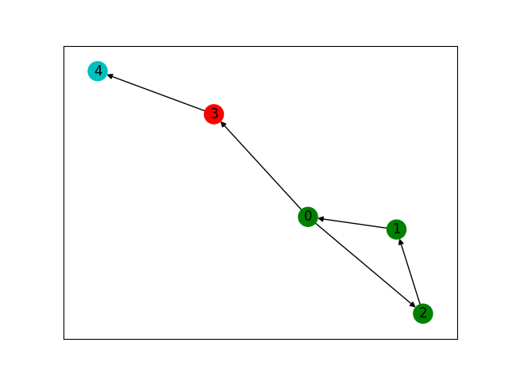
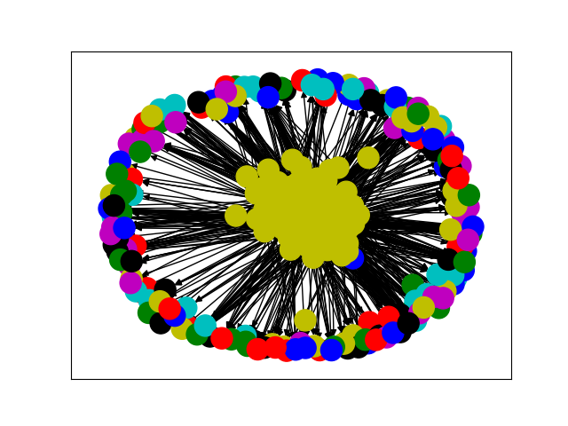

# Members

- [Rohit Dwivedula](https://github.com/rohitdwivedula/) (2017A7PS0029H)
- [Varad Kshirsagar](https://github.com/Varad2305/) (2017A7PS0141H)
- [Vamsi Nallappareddy](https://github.com/vam-sin/) (2017A7PS0029H)

# Installation and Runtime Instructions

1. Install `*.cpp` files using commands of the format `g++ traditional_scc.cpp -o a.out`.
2. To run the traditional SCC algorithm on existing datasets (in this repo) use a command in this format: `cat datasets/small_examples/example1.txt | ./a.out example_1_output.txt`. The output will be saved in the command line argument, which in this case is `example_1_output.txt`. Each line of the output file is one strongly connected component, with each line consisting of space-separated integers. 
3. To visualise the output run `python3 visualise.py datasets/small_examples/example1_ouput.txt datasets/small_examples/example1.txt` where the first command line argument is the output of the SCC algorithm, and the second line is the adjacency list of the graph. The graph will be plotted with each SCC in a different color. 
4. Doxygen has been set up in the source files, and HTML, Latex documentation for this project can be generated by running `doxygen .doxygen-config` in the root directory of this project. 

# Runtimes on Large Datasets (seconds)

| S. No | Dataset                  | Nodes   | Edges    | Traditional  |     DCSC     |
|-------|--------------------------|---------|----------|--------------|--------------|
| 1     | Wikipedia Voting Dataset | 7115    | 103689   | 18.742       | 168.699	  |
| 2     | Email EU Dataset         | 1005    |  25571   |  0.638       | 9.416		  |
| 3     | Gnutella P2P Aug-5       | 8846    |  31839   | 28.271       | 137.038	  |
| 4     | Gnutella P2P Aug-6       | 8717    |  31525   | 27.892       | 143.69		  |
| 5     | Gnutella P2P Aug-8       | 6301    |  20777   | 13.891       | 161.72		  |
| 6     | Gnutella P2P Aug-9       | 8114    |  26013   | 22.754       | 196.33		  |

All these datasets were run on computers from Systems Lab, which have the configuration: `Intel® Core™ i7-8700 CPU @ 3.20GHz × 12, Memory: 7.7 GiB`. 

# Visualisation

Used the NetworkX Python library to visualise the graphs. The strongly connected components are plotted in different colors. Trying to plot really large graphs becomes pointless very quickly, since the number of elements becomes too confusing. The second plot shown below is a plot of the EU email database, which at ~1000 nodes is the smallest of the datasets from SNAP. Even this, however, is too much to reliably process on one screen. A small graph visualised is given below. The green points form the largest strongly connected component set. 

A large graph - pretty undecipherable.

